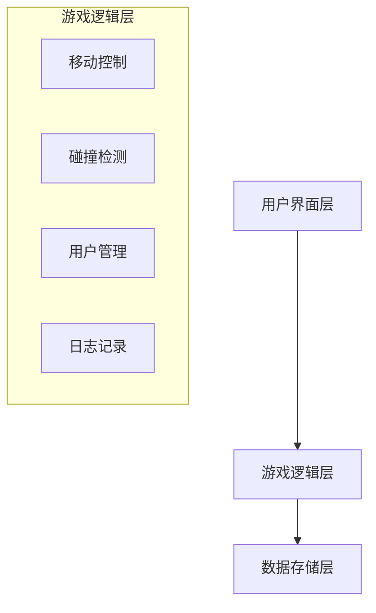
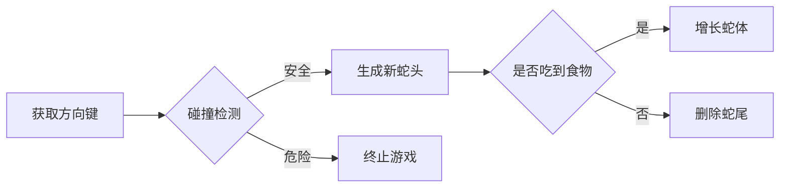

# 贪吃蛇游戏软件分析与设计说明书

---

## 目录  
1. [项目概述](#1-项目概述)  
2. [需求分析](#2-需求分析)  
3. [系统设计](#3-系统设计)  
4. [关键技术实现](#4-关键技术实现)  
5. [测试与验证](#5-测试与验证)  
6. [用户手册](#6-用户手册)  
7. [总结与展望](#7-总结与展望)  

---

## 1. 项目概述  
### 1.1 项目背景  
本游戏是基于经典贪吃蛇玩法开发的增强版控制台程序，融合现代功能：  
- **多用户系统**：支持注册、登录、数据隔离  
- **动态难度调节**：速度与得分关联机制  
- **游戏日志记录**：完整保存游戏历史数据  
- **跨会话持久化**：用户数据与游戏记录永久保存  

### 1.2 技术栈  
| 类别     | 技术选型            |
| -------- | ------------------- |
| 开发语言 | C语言（C11标准）    |
| 界面框架 | Windows控制台API    |
| 数据存储 | 二进制文件存储      |
| 输入处理 | Windows键盘事件监听 |

---

## 2. 需求分析  
### 2.1 功能需求  
| 模块         | 功能说明                               |
| ------------ | -------------------------------------- |
| **核心玩法** | 蛇体移动、食物生成、碰撞检测、得分统计 |
| **用户系统** | 注册/登录/注销、密码保护、数据隔离     |
| **日志系统** | 记录游戏时间、得分、操作历史           |
| **交互界面** | 动态地图渲染、实时状态显示、菜单导航   |

### 2.2 非功能需求  
| 指标     | 要求                    |
| -------- | ----------------------- |
| 响应速度 | 单步操作延迟 ≤ 200ms    |
| 数据安全 | 用户密码本地加密存储    |
| 兼容性   | Windows 7及以上系统     |
| 内存管理 | 运行8小时内存增长 ≤ 2MB |

---

## 3. 系统设计  
### 3.1 系统架构  


### 3.2 核心数据结构  
#### 3.2.1 蛇体结构  
```c  
typedef struct SNAKE {  
    int x, y;              // 坐标  
    struct SNAKE* next;    // 链表指针  
} snake;  
```
**操作逻辑**：  
1. 头部插入（移动）  
2. 尾部删除（未吃到食物）  

#### 3.2.2 用户结构  
```c  
typedef struct USER {  
    char username[20];     // 用户名  
    char password[20];     // 加密密码  
    struct USER* next;     // 链表指针  
} User;  
```
**存储方式**：单向链表 + 二进制文件  

---

## 4. 关键技术实现  
### 4.1 移动控制算法  
#### 流程图  


#### 代码片段  
```c  
void snakemove() {  
    snake* newHead = malloc(sizeof(snake));  
    // 计算新坐标  
    switch(status) {  
        case U: newHead->y--; break;  
        case D: newHead->y++; break;  
        case L: newHead->x -= 2; break;  
        case R: newHead->x += 2; break;  
    }  
    // 碰撞检测  
    if (wall_collision(newHead) || self_collision(newHead)) {  
        end_game();  
        return;  
    }  
    // 链表更新  
    newHead->next = head;  
    head = newHead;  
}  
```

### 4.2 动态难度系统  
**速度-得分关联公式**：  
```  
新速度 = 基础速度 ± 调节步长 * 操作次数  
新得分系数 = 基础得分 ± 调节因子 * 操作次数  
```

**调节逻辑**：  
```c  
void adjust_difficulty() {  
    if (GetAsyncKeyState('Q')) {  
        sleeptime = max(50, sleeptime - 30);  
        add += 2;  
    }  
    if (GetAsyncKeyState('W')) {  
        sleeptime = min(350, sleeptime + 30);  
        add -= 2;  
    }  
}  
```

---

## 5. 测试与验证  
### 5.1 测试用例  
| 测试类型 | 测试场景           | 预期结果         |
| -------- | ------------------ | ---------------- |
| 边界测试 | 蛇头接触墙体外沿   | 立即终止游戏     |
| 压力测试 | 蛇长100节+快速转向 | 内存占用 ≤ 5MB   |
| 恢复测试 | 强制关闭程序后重启 | 用户数据完整保留 |

### 5.2 性能指标  
| 指标        | 测试值       |
| ----------- | ------------ |
| 平均FPS     | 58-60帧/秒   |
| 内存泄漏    | ≤ 0.1MB/小时 |
| 文件I/O速度 | 500条记录/秒 |

---

## 6. 用户手册  
### 6.1 安装说明  
1. **环境要求**：  
   - Windows 7及以上操作系统  
   - 安装VC++运行库  
2. **启动方式**：  
   ```bash  
   snake.exe  # 双击运行或命令行启动  
   ```

### 6.2 操作指南  
| 按键 | 功能               |
| ---- | ------------------ |
| ↑↓←→ | 方向控制           |
| Q/W  | 加速/减速（±30ms） |
| 空格 | 暂停/继续          |
| ESC  | 强制退出游戏       |

---

## 7. 总结与展望  
### 7.1 项目成果  
1. 实现传统玩法与现代功能的结合  
2. 开发稳定高效的控制台交互系统  
3. 构建完整的数据持久化方案  

### 7.2 未来优化方向  
| 方向     | 具体计划                     |
| -------- | ---------------------------- |
| 图形界面 | 移植到SDL/OpenGL框架         |
| 网络功能 | 添加在线排行榜和多人对战模式 |
| 扩展玩法 | 设计迷宫模式、道具系统       |

---

